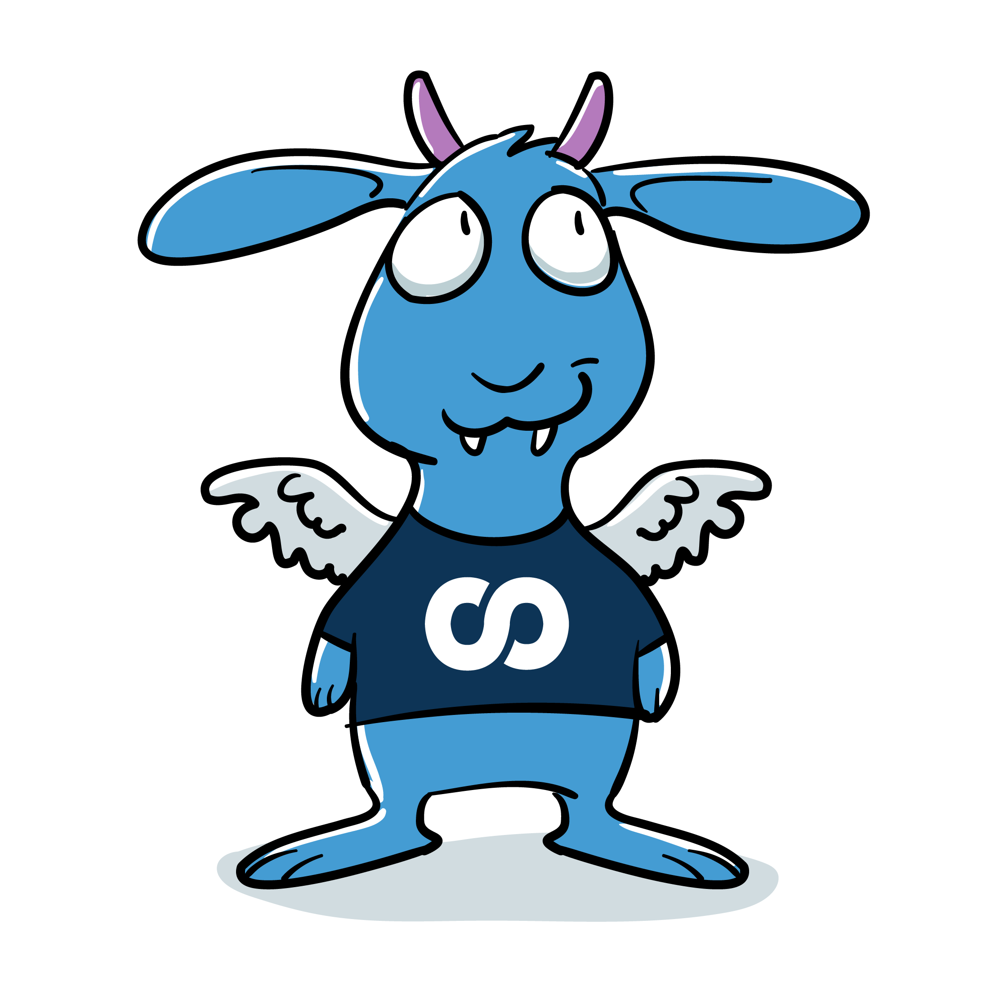

[](https://github.com/foomo/claude-code/blob/main/LICENSE)
[](https://github.com/foomo/claude-code)

<p align="center">
  
</p>

# Claude Code

> Claude Code marketplace

## Plugins

- [`obacht`](plugins/obacht) — runs the `obacht` security scanner and presents results as a severity-grouped report
- [`skills`](plugins/skills) — common shared skills (GitHub Actions hardening, PR descriptions)
- [`superpowers`](plugins/superpowers) — foomo defaults layered on top of the upstream `superpowers` plugin

## Installation

```shell
/plugin marketplace add foomo/claude-code
/plugin install obacht@foomo
/plugin install skills@foomo
/plugin install superpowers@foomo
```

## How to Contribute

Contributions are welcome! Open an issue or pull request.


## License

Distributed under MIT License, please see license file within the code for more details.

_Made with ♥ [foomo](https://www.foomo.org) by [bestbytes](https://www.bestbytes.com)_
